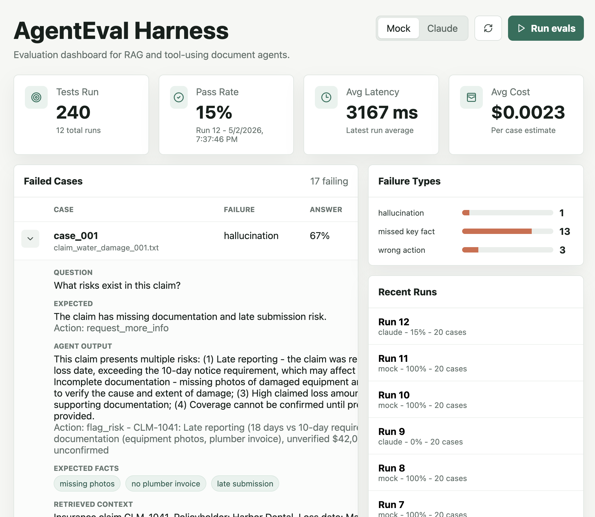
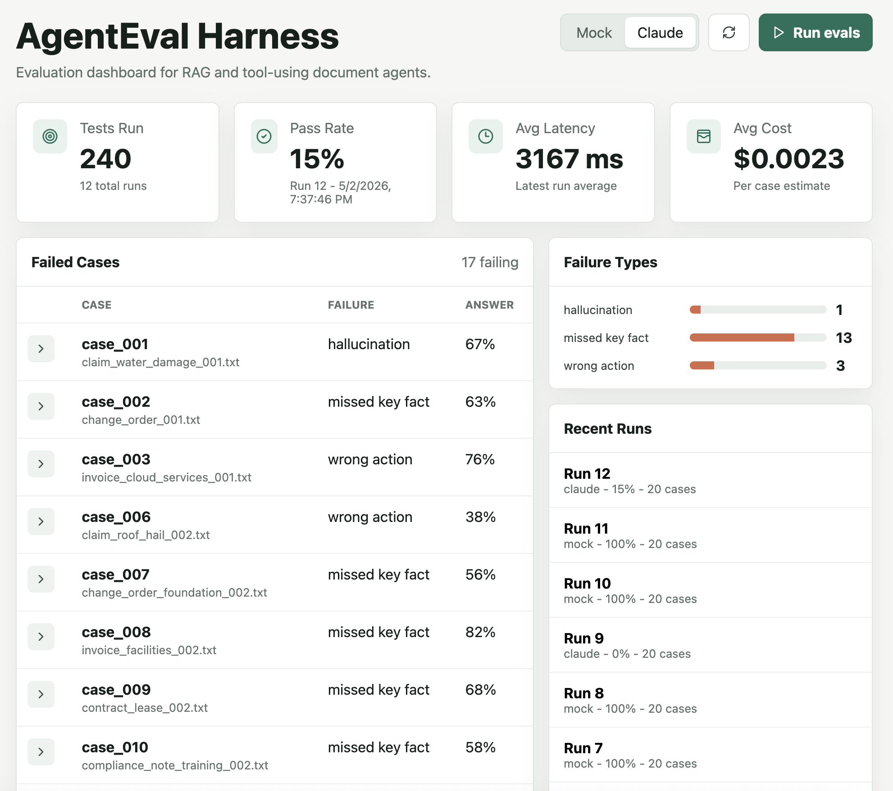

# AgentEval Harness: Evaluation System for RAG + Tool-Using AI Agents

AgentEval Harness is a small full-stack evaluation system for document-based AI agents. It runs an agent against seeded business documents, checks the answer and selected action, and reports reliability metrics in a dashboard.

The default path uses deterministic mock mode, so the project runs locally without credentials. Live runs support Anthropic Claude and OpenAI models, using either a per-run key entered in the dashboard or a provider key from the local environment.

## Screenshots





## What It Measures

- Answer correctness against expected answers and facts
- Fact recall and fact precision
- Tool/action correctness
- Action input correctness
- Retrieval hit rate and groundedness against retrieved chunks
- JSON schema validity
- Optional LLM judge score for semantic grading
- Hallucination signals, latency, estimated cost, and failure reason

## How Evaluation Works

Each test case is a small "golden" example in `data/seed_cases.json`. The document text is the source of truth, and the expected fields are written from that document:

- `expected_answer`: the concise answer the agent should give
- `expected_facts`: the specific document facts that must be present or clearly represented in the answer
- `expected_action`: the tool/action the agent should choose for the workflow

At runtime, the harness chunks the document, retrieves the most relevant chunks for the question using token overlap, and passes those chunks to the agent. The evaluator then compares the agent output against the golden case:

- `answer_match` checks overlap with the expected answer and required facts.
- `fact_recall` checks how many required facts appeared in the answer.
- `fact_precision` estimates how much of the answer is supported by the source document.
- `retrieval_hit` checks whether the retrieved chunks contain the expected facts.
- `groundedness` checks whether the answer is supported by the retrieved chunks.
- `tool_correct` checks whether the selected action exactly matches `expected_action`.
- `action_input_score` checks whether the tool/action argument includes the right reason, amount, item, or task.
- `schema_valid` verifies that live model output used the required JSON shape.
- `judge_score` is optional and asks the selected live model to grade semantic correctness. It is slower and costs more, so deterministic scoring remains the default.
- `hallucination_score` looks for unsupported money amounts or important terms in the answer that do not appear in the source document.
- `failure_type` summarizes the main issue, such as `missed_key_fact`, `wrong_action`, `hallucination`, or `agent_error`.

The retrieved context is shown in the run detail so a reviewer can see whether a failure came from retrieval, answer generation, or tool selection. For example, if the right chunk was retrieved but the answer missed a required fact, that points to an agent/prompt issue rather than a retrieval issue.

## Interpreting Results

A low pass rate does not automatically mean the model is bad. The harness is intentionally strict: an answer can sound reasonable and still fail if it misses required facts, chooses the wrong workflow action, or adds unsupported details. That is the point of the project: it turns qualitative agent behavior into reviewable failure modes.

For example, a Claude run may retrieve the right document context and answer the main question, but still fail because it omitted a cost component, deadline, policy threshold, or required action. The dashboard separates matched facts from missed facts so it is clear whether the issue came from retrieval, answer generation, or tool selection.

## Resume Bullets

- Built an agent evaluation harness to test document-based AI workflows across 20+ cases, measuring answer accuracy, tool-use correctness, latency, cost, and failure modes.
- Designed an agent eval system with test cases, scoring logic, failure-mode analysis, and dashboarding to improve reliability of RAG + tool-using AI workflows.

## Architecture

- `backend/app`: FastAPI API, SQLite/Postgres persistence, RAG retrieval, agent runners, scoring logic
- `data/seed_cases.json`: 20 fake business documents and matching eval cases
- `frontend/src`: Vite React dashboard for running and inspecting evals
- `backend/tests`: dataset, evaluator, and API tests

The app uses SQLite by default for local development. A deployed version should use hosted Postgres, such as Supabase or Neon, because Vercel serverless functions should not rely on local SQLite files for persistent storage. Set `AGENTEVAL_DATABASE_URL` to a Postgres connection string in production. The app intentionally ignores generic `DATABASE_URL` values so it does not accidentally connect to another local project database.

## Backend Setup

```bash
python3 -m venv .venv
source .venv/bin/activate
pip install -e ".[dev]"
uvicorn backend.app.main:app --reload
```

The API will run at `http://localhost:8000`.

## Frontend Setup

```bash
cd frontend
npm install
npm run dev
```

The dashboard will run at `http://localhost:5173`.

## Running Evals

Mock provider is the default and works without credentials:

```bash
curl -X POST http://localhost:8000/api/runs \
  -H "Content-Type: application/json" \
  -d '{"provider":"mock"}'
```

Live providers can be selected from the dashboard or requested from the API with `provider` set to `anthropic` or `openai`. You can pass `model`, optional `case_ids`, and `judge_enabled`. API keys are read in this order: per-run key from the dashboard or API request first, then the matching environment variable. Per-run keys are not stored in the database.

Environment variables used by live providers:

- `ANTHROPIC_API_KEY`
- `OPENAI_API_KEY`
- `AGENTEVAL_DATABASE_URL`

## API

- `GET /api/cases`: list seeded eval cases
- `POST /api/runs`: run all cases or selected case IDs with `provider=mock|anthropic|openai`
- `GET /api/runs`: list recent eval runs
- `GET /api/runs/{run_id}`: inspect one run and its case results
- `GET /api/summary`: latest dashboard summary

## Testing

```bash
pytest
```

The test suite covers seed data loading, scoring behavior, mock-provider runs, multi-provider request handling, and the core API endpoints.

## Deploying to Vercel

This repo includes `vercel.json` and `api/index.py` so the Vite frontend and FastAPI backend can be deployed as one Vercel project. For persistence, create a hosted Postgres database in Supabase or Neon and add its connection string as `AGENTEVAL_DATABASE_URL` in Vercel project settings. Add `ANTHROPIC_API_KEY` and/or `OPENAI_API_KEY` only if you want server-side live-provider credentials.

Deployment flow:

1. Create a Supabase or Neon Postgres database.
2. Add `AGENTEVAL_DATABASE_URL` to Vercel environment variables.
3. Optionally add `ANTHROPIC_API_KEY` and `OPENAI_API_KEY`.
4. Import this GitHub repo into Vercel and deploy.

The MVP keeps runs synchronous. Vercel functions can time out on long live full-suite runs, so use selected `case_ids` for small live demos. A production version should move long eval suites to a background worker or queue and manage schema changes with migrations such as Alembic.

